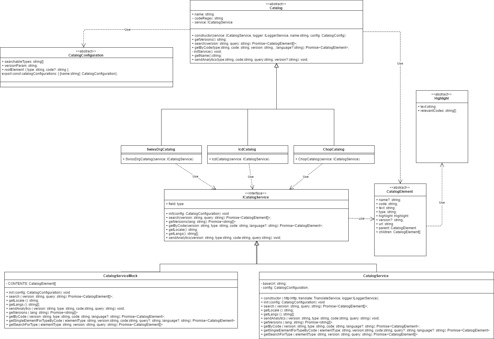

# Architektur eonum search frontend

Die MedCodeSearch Software erlaubt es, mehrere verschiedene Kataloge nach Elementen zu durchsuchen. In diesem Dokument is beschrieben, wie die Architektur dahinter aussieht.

Die eonum-API kennt drei verschiedene Kataloge. Diese Kataloge weisen zahlreiche Gemeinsamkeiten auf, welche teilweise in eine Oberklasse `Catalog` ausgelagert wurden.

Da jeder Katalog auch einige Besonderheiten besitzt, wird jeder Katalog durch eine eigene Klasse modelliert (`SwissDrgCatalog`, `ChopCatalog` und `IcdCatalog`). Katalog-spezifisches Verhalten kann damit gekapselt werden.

Die Kataloge kommunizieren nicht direkt mit der eonum-API, da dies die Testbarkeit der Kataloge beeinträchtigen würde. Die eonum API wird von der Klasse `CatalogService` abgefragt, welche des Interface `ICatalogService` implementiert.

Zum Testen können beliebige Fake-Objekte, welche das `ICatalogService`-Interface implementieren, im Konstruktor an einen Katalog übergeben werden. Die `CatalogServiceMock` Klasse ist ein solches Fake-Object.

Die Klasse `CatalogElement` modelliert ein Objekt aus einem Katalog. `CatalogElement` enthält dabei alle Eigenschaften der Objekte, welche in allen Katalogen gleich sind.

Die Klasse `CatalogConfiguration` dient zur Initialisierung des `CatalogService` und beinhaltet Daten wie die Katalog-Suchadressen und die verfügbaren Versionen.